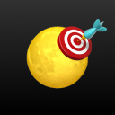

<p align="center">
    
</p>
<h1 align="center">Moon Shooter 🌙</h1>

> A shooteing VR game made with A-Frame 1.5, Vue 3.4 and Vite 5.0


### [>> DEMO <<]()

## Context

This project is part of an optional course taught at HEIG-VD during the 3rd year of the Bachelor's degree in Media Engineering. The aim was to introduce us to virtual reality by creating a VR experience using the A-Frame framework.

### My game

You're sent to the moon to hone your shooting skills in preparation for the upcoming intergalactic war with the Marsians. The training program requires you to pick up a laser pistol and hit as many targets as possible within 30 seconds. Once the countdown is over, you can try again to increase your best score.

## Included in the game

### Libs and components

- [aframe-extras controls and animation-mixer](https://github.com/c-frame/aframe-extras) (MIT License)
- [aframe physx](https://github.com/c-frame/physx) (MIT License)
- [aframe-blink-controls](https://github.com/jure/aframe-blink-controls) (MIT License)
- [simple-navmesh-constraint](https://github.com/AdaRoseCannon/aframe-xr-boilerplate) (MIT Licence)
- [a-frame-vite-vue-boilerplate](https://github.com/Chabloz/a-frame-vite-vue-boilerplate) (MIT Licence)
- [aframe-super-shooter-kit](https://github.com/supermedium/aframe-super-shooter-kit)

### Movement modes support

- **Desktop** – Keyboard for move (_WASD_ or Arrows keys) + Mouse for look control (Drag and shoot)
- **VR Headset** – AR/VR walk + Gaze cursor for click

### 3D models

- **Moon surface** – [Moon - Giordano Bruno Crater](https://sketchfab.com/3d-models/moon-giordano-bruno-crater-1f49ab263ba1403f8874ae92743bb654) by [SebastianSosnowski](https://sketchfab.com/SebastianSosnowski) is licensed under [CC BY 4.0](https://creativecommons.org/licenses/by/4.0/)
- **Main platform** – [Round platform](https://sketchfab.com/3d-models/round-platform-64de8f896e3e40e4a1e8a67d01620ac1) by [n0stardust](https://sketchfab.com/noortjeschuur) is licensed under [CC BY 4.0](https://creativecommons.org/licenses/by/4.0/)
- **Landing platform** – [Landing Pad](https://sketchfab.com/3d-models/landing-pad-c7c1ec44c9d54299ba2ec4fe246437b0) by [Galvingibbons556](https://sketchfab.com/Galving16) is licensed under [CC BY 4.0](https://creativecommons.org/licenses/by/4.0/)
- **Landing platform stairs** – [SciFi Walkways Grunge Stairs](https://sketchfab.com/3d-models/scifi-walkways-grunge-stairs-3d56f1b363d848b3b7d452920a59cab7) by [The Elliseran Modeller](https://sketchfab.com/kenlong) is licensed under [CC BY 4.0](https://creativecommons.org/licenses/by/4.0/)
- **Score and timer panel** – [SciFi panel](https://sketchfab.com/3d-models/scifi-panel-d93944548ef64adba8e0e6ebdfd75136) by [Sousinho](https://sketchfab.com/sousinho) is licensed under [Free Standard](https://sketchfab.com/licenses)
- **Shooting range** – [Sci-fi Panel](https://sketchfab.com/3d-models/sci-fi-panel-c53e038103544d17b8f0d81a8122ffd6) by [OverLord](https://sketchfab.com/San.Dro) is licensed under [CC BY 4.0](https://creativecommons.org/licenses/by/4.0/)
- **Exit terminal** – [Sci-Fi Master Control Terminal](https://sketchfab.com/3d-models/sci-fi-master-control-terminal-09587291d8e84cbd87c963a2dcf5f5e6) by [Esfinges](https://sketchfab.com/Akturus) is licensed under [CC BY 4.0](https://creativecommons.org/licenses/by/4.0/)
- **Laser pistol** – [Stylized Gun](https://sketchfab.com/3d-models/stylized-gun-2983dac401d741349ff35ff91a1786f0) by [Vasko Petrov](https://sketchfab.com/vaskopetrov) is licensed under [CC BY 4.0](https://creativecommons.org/licenses/by/4.0/)
- **Crate / Target** – [Sci-fi Crate](https://sketchfab.com/3d-models/sci-fi-crate-0e60a62a8f1e4048b638a32eb0661015) by [Darren McNerney 3D](https://sketchfab.com/DarrenMcnerney3D) is licensed under [CC BY 4.0](https://creativecommons.org/licenses/by/4.0/)
- **Table** – [Sci-Fi Table](https://sketchfab.com/3d-models/sci-fi-table-05de9f03e78449ad8691715f02b74839) by [nenkea](https://sketchfab.com/nenkea) is licensed under [CC BY 4.0](https://creativecommons.org/licenses/by/4.0/)

---

## Quickstart

### Create a folder for your project and move to it

### Clone (or fork, or download)

```sh
git clone git@github.com:nicomeuwly/moon-shooter.git .
```

### Install dependencies

```sh
npm ci
```

### Dev

```sh
npm run dev
```

### Build

```sh
npm run build
```

## Notes for local dev on VR headset

1. Check that your development device and your VR headset are connected on **the same network**.

2. Expose you local development:

```sh
npm run dev-expose
```

3. In your VR headset, browse to the local development adress `[ip]:[port]`.

> [!NOTE]  
> The certificate is self-signed, so you will probably have to confirm access to the resource in your browser.

---

## License


